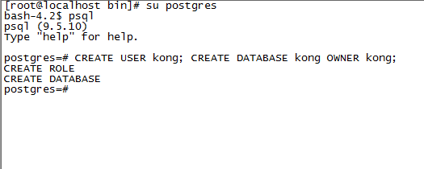
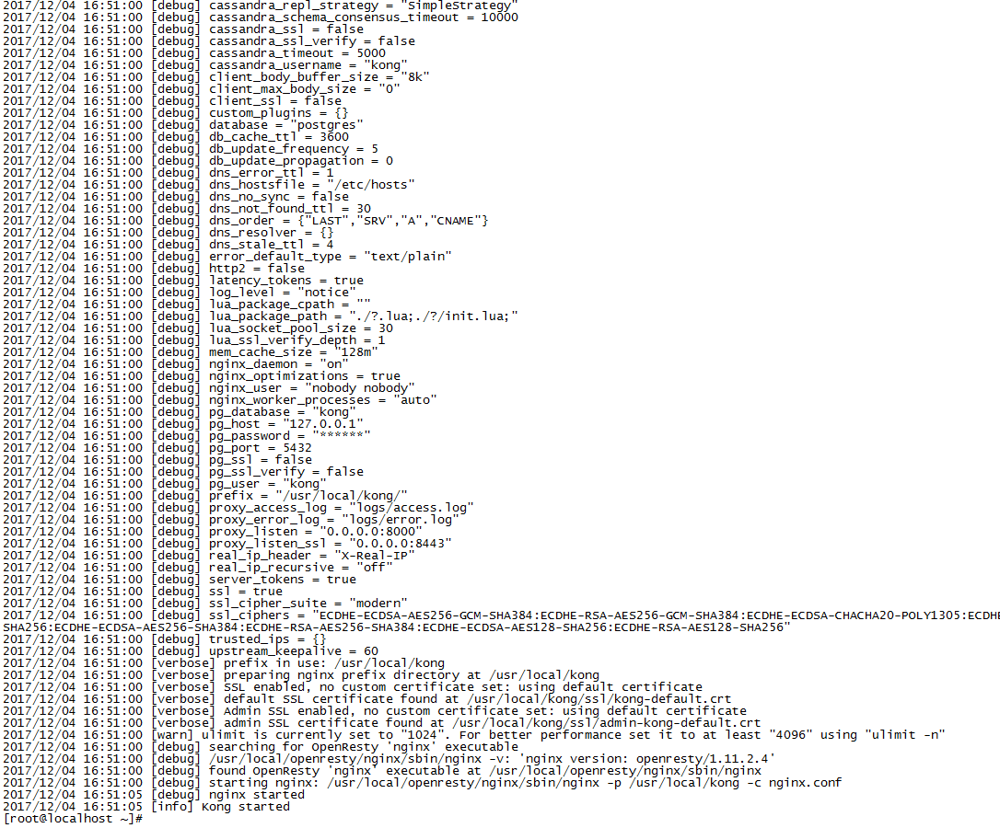
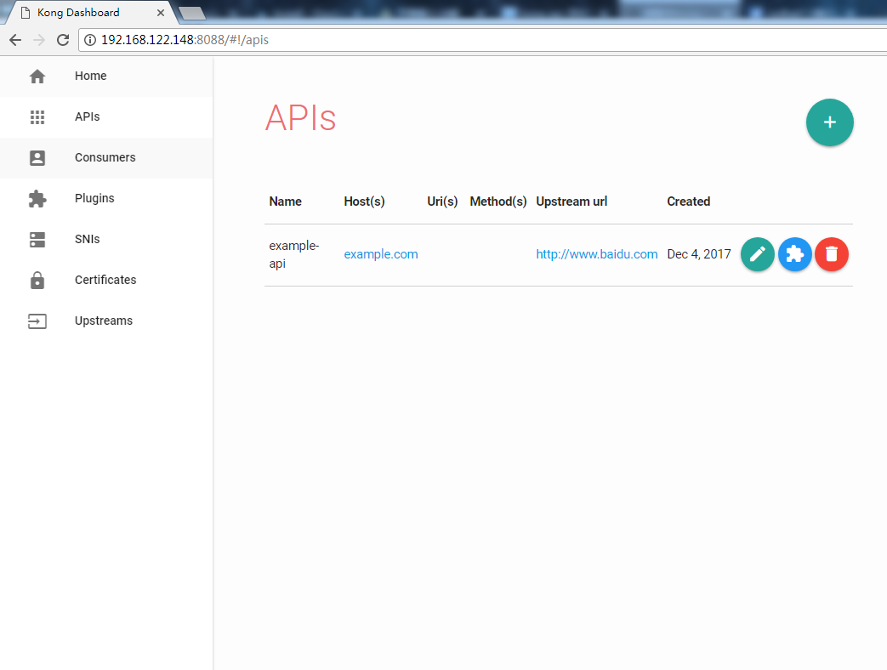

## api网关-kong的安装和介绍

### kong的作用

	HTTP基本认证
	密钥认证
	CORS（Cross-origin Resource Sharing，跨域资源共享）
	TCP/UDP/文件日志/API请求限流
	请求转发以及Nginx监控

官方开源：[https://github.com/Kong/kong](https://github.com/Kong/kong)

### Kong主要有两个主要的组件

##### Server:

是基于Nginx的服务器，用来接收API请求；

##### Cassandra / PostgreSQL:

用来存储操作数据。

Kong中可以通过插件扩展已有功能，这些插件在API请求响应循环的生命周期中被执行,插件使用Lua编写。

### 安装kong

[官方安装](https://getkong.org/install/centos/?_ga=2.243520581.1173124086.1512359359-347980248.1512125012)

##### 方式1 (yum源直接安装)

环境准备，添加yum源：
>https://bintray.com/kong/kong-community-edition-rpm 选择set me up
>https://bintray.com/kong/kong-community-edition-rpm/centos 选择set me up

	mkdir -p /home/kubernetes/kong && cd /home/kubernetes/kong

	#得到文件bintray-kong-kong-community-edition-rpm.repo
	wget https://bintray.com/kong/kong-community-edition-rpm/rpm -O bintray-kong-kong-community-edition-rpm.repo

	#移动文件到Yum源中
	sudo mv bintray-kong-kong-community-edition-rpm.repo /etc/yum.repos.d/

	#更新yum源
	yum clean all && yum makecache
	yum update

	#安装
	yum install kong -y

	

##### 方式2安装：

	cd /home/kubernetes/kong
	#下载并重命名
	wget https://bintray.com/kong/kong-community-edition-rpm/download_file?file_path=dists/kong-community-edition-0.11.2.el7.noarch.rpm  -O kong-community-edition-0.11.2.el7.noarch.rpm
	#安装kong
	yum install epel-release
	yum install kong-community-edition-0.11.2.el7.noarch.rpm -y
	#查看Kong
	$ kong version
	0.11.2

至此kong已经安装完成

### 安装数据库(Cassandra / PostgreSQL)
>Configure Kong so it can connect to your database. Kong supports both PostgreSQL 9.4+ and Cassandra 3.x.x as its datastore.

	yum install -y http://yum.postgresql.org/9.5/redhat/rhel-7-x86_64/pgdg-redhat95-9.5-2.noarch.rpm
	yum install -y postgresql95-server postgresql95-contrib
	#初始化数据库
	$ /usr/pgsql-9.5/bin/postgresql95-setup  initdb
	Initializing database ... OK
	#启动pstgresql
	systemctl enable postgresql-9.5.service  
    systemctl start postgresql-9.5.service  
    systemctl status postgresql-9.5.service  

##### 使用数据库

	su postgres  #切换用户
	psql   #登录

	# CREATE USER kong; CREATE DATABASE kong OWNER kong;无密码
	CREATE ROLE kong LOGIN ENCRYPTED PASSWORD 'pw123456' NOINHERIT VALID UNTIL 'infinity';
	CREATE DATABASE kong WITH ENCODING='UTF8' OWNER=kong;
	grant ALL PRIVILEGES ON DATABASE kong to kong;

退出psql

	\q
	su root

操作：
	
	#删除数据库
	drop database kong;
	#删除角色
	drop role kong; 
	#查看用户
	\du
	#查看数据库
	\l
	#设置新密码
	\password postgres

### 使用kong

配置：

	cd /etc/kong/
	cp kong.conf.default kong.conf
	# 编辑以下内容
	database = postgres             # 数据库类型 postgres/cassandra
	pg_host = 127.0.0.1             # 数据库主机地址
	pg_port = 5432                  # 数据库侦听端口
	pg_user = kong                  # 用户名
	pg_password = pw123456              # 密码
	pg_database = kong              # 数据库名
	pg_ssl = off                    
	pg_ssl_verify = off

启动：

	kong migrations up -c /etc/kong/kong.conf
	kong start --vv

在浏览器输入地址:http://192.168.122.148:8001 显示kong的版本信息等！

### ui
> https://github.com/PGBI/kong-dashboard

	docker run --rm -p 8088:8080 pgbi/kong-dashboard start --kong-url http://192.168.122.148:8001

然后浏览器访问：

http://192.168.122.148:8088/

### 使用

添加api:

	curl -i -X POST \
  	--url http://localhost:8001/apis/ \
  	--data 'name=example-api' \
  	--data 'hosts=example.com' \
  	--data 'upstream_url=http://www.baidu.com'

	name:自己的api name
	upstream_url:API地址
	request_host:API地址

显示：

	HTTP/1.1 201 Created
	Date: Mon, 04 Dec 2017 10:09:37 GMT
	Content-Type: application/json; charset=utf-8
	Transfer-Encoding: chunked
	Connection: keep-alive
	Access-Control-Allow-Origin: *
	Server: kong/0.11.2
	
	{"created_at":1512382177135,"strip_uri":true,"id":"690f46f2-71b5-4fe4-a42b-e929dc9ff88d","hosts":["example.com"],"name":"example-api","http_if_terminated":false,"preserve_host":false,"upstream_url":"http:\/\/www.baidu.com","upstream_connect_timeout":60000,"upstream_send_timeout":60000,"upstream_read_timeout":60000,"retries":5,"https_only":false}

现在，KONG里已经添加了您的API并做好了代理的准备。

通过Kong转发您的请求：

	curl -i -X GET --url http://localhost:8000/ --header 'Host: example.com'

一个成功的相应，意味着KONG已经将（http://localhost:8000）请求转发到了我们在第一步中配置的 upstream_url 里，并将response转发给我们了。

问题汇总：

Q1：

ulimit is currently set to "1024". For better performance set it to at least "4096" using "ulimit -n"
Error: /usr/local/share/lua/5.1/kong/cmd/start.lua:18: [postgres error] FATAL: Ident authentication failed for user "kong"

A1:

	su - postgres
	createdb kong
	psql kong
	create user kong with password 'pw123456';
	CREATE DATABASE kong OWNER kong;
	grant ALL PRIVILEGES ON DATABASE kong to kong;

验证：

	-bash-4.2$ psql -d kong -U kong -w
	psql: FATAL:  Peer authentication failed for user "kong"

查看报错信息：

	su - postgres #切换用户
	cd /var/lib/pgsql/9.5/data/pg_log
	tail -f pg_log/postgresql-Wed.log

看到报错信息如下:

	< 2017-12-04 16:45:38.721 CST >LOG:  could not connect to Ident server at address "127.0.0.1", port 113: Connection refused
	< 2017-12-04 16:45:38.721 CST >FATAL:  Ident authentication failed for user "kong"
	< 2017-12-04 16:45:38.721 CST >DETAIL:  Connection matched pg_hba.conf line 82: "host    all             all             127.0.0.1/32            ident"
	< 2017-12-04 16:45:44.261 CST >LOG:  could not connect to Ident server at address "127.0.0.1", port 113: Connection refused
	< 2017-12-04 16:45:44.261 CST >FATAL:  Ident authentication failed for user "kong"
	< 2017-12-04 16:45:44.261 CST >DETAIL:  Connection matched pg_hba.conf line 82: "host    all             all             127.0.0.1/32            ident"

vi /var/lib/pgsql/9.5/data/pg_hba.conf,在大概82行，将

	host    all             all             127.0.0.1/32            ident

改成

	host    all             all             127.0.0.1/32            md5

vi /var/lib/pgsql/9.5/data/postgresql.conf

	
	listen_addresses = '*' 
	port = 5432

重启：

	systemctl restart postgresql-9.5.service 

	

参考文档：

http://www.jianshu.com/p/9b4e537ebca6

https://getkong.org/docs/0.9.x/getting-started/quickstart/

https://getkong.org/install/centos/

https://github.com/Kong/kong/issues/1893

http://jialeicui.github.io/blog/kong_dev_env.html

http://ju.outofmemory.cn/entry/318530

http://blog.csdn.net/qq_35357001/article/details/75015484
	
	

	

