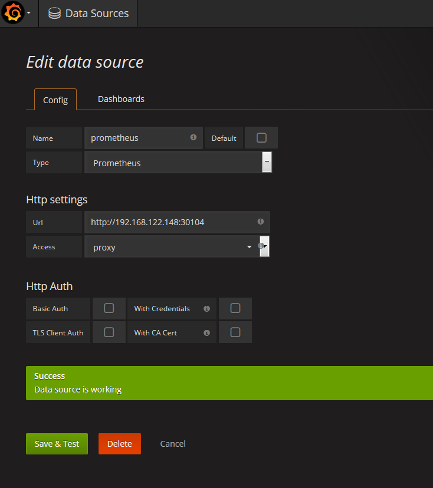
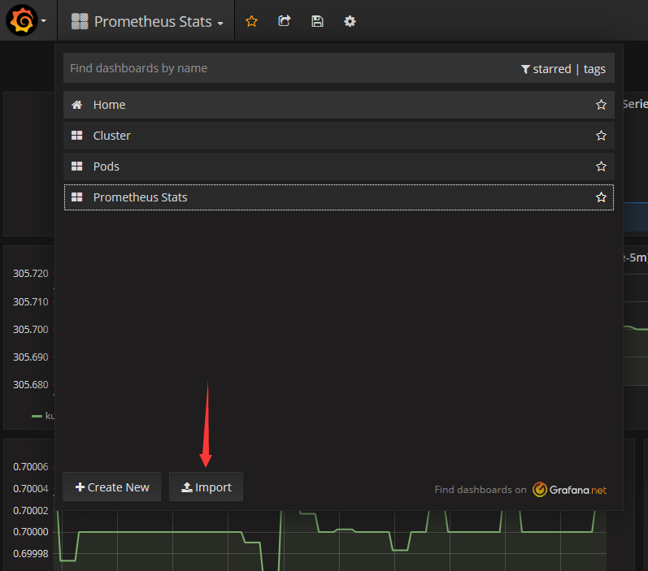
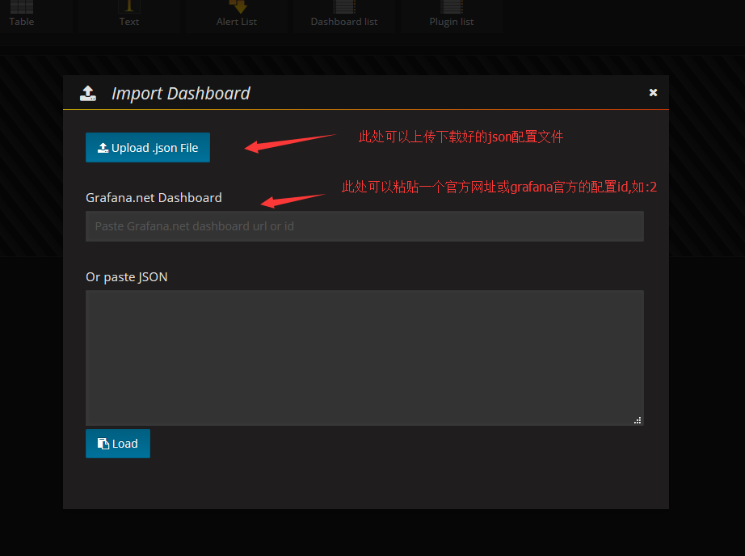
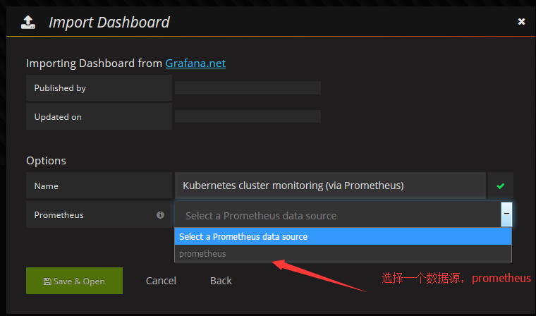
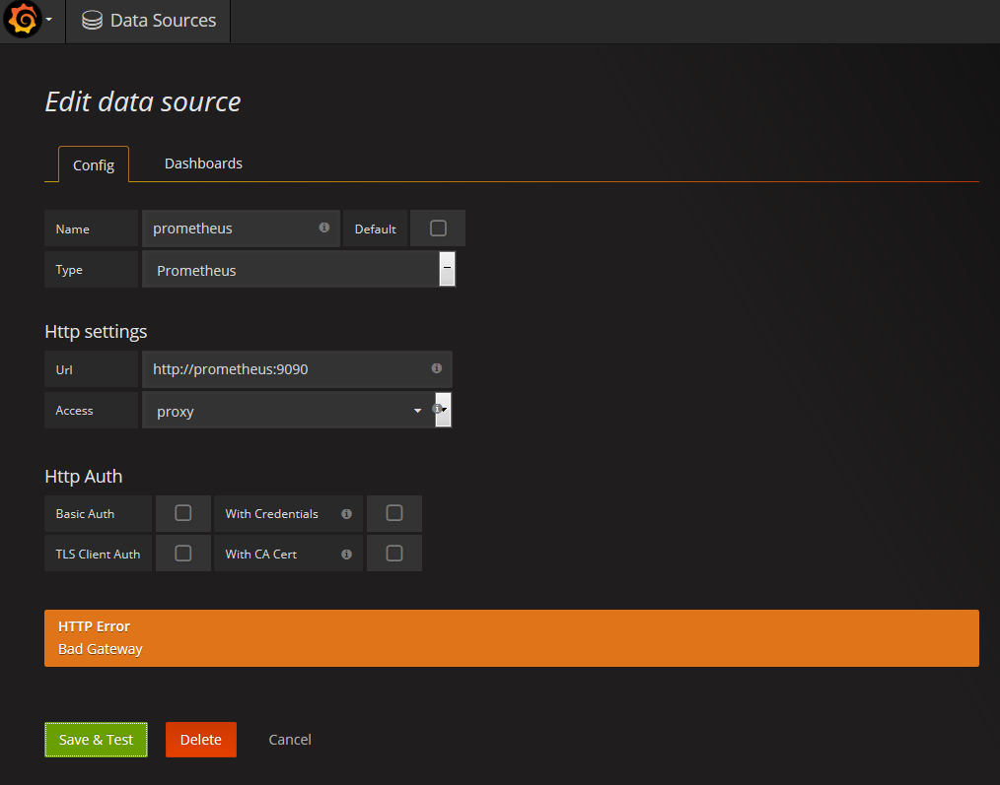
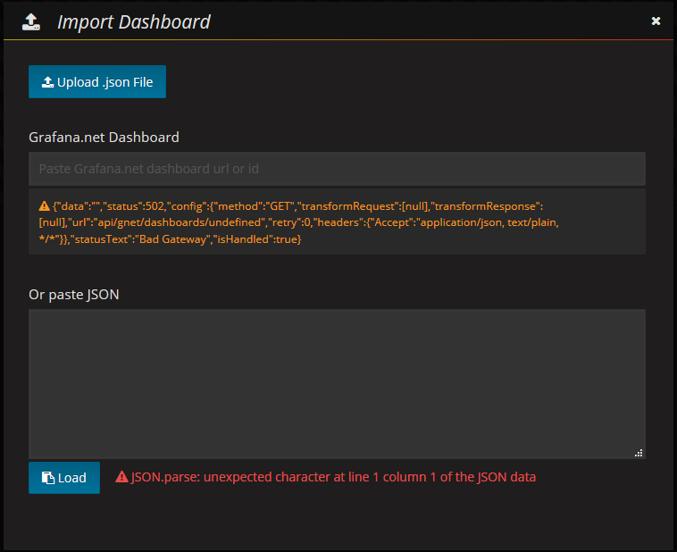

### prometheus监控安装

代理服务器下载：

	docker tag quay.io/prometheus/alertmanager:v0.7.1 registry.cn-hangzhou.aliyuncs.com/zhg_docker_ali_r/alertmanager:v0.7.1
	docker push registry.cn-hangzhou.aliyuncs.com/zhg_docker_ali_r/alertmanager:v0.7.1

	docker tag grafana/grafana:4.2.0 registry.cn-hangzhou.aliyuncs.com/zhg_docker_ali_r/grafana:4.2.0
	docker push registry.cn-hangzhou.aliyuncs.com/zhg_docker_ali_r/grafana:4.2.0

	docker tag giantswarm/tiny-tools registry.cn-hangzhou.aliyuncs.com/zhg_docker_ali_r/tiny-tools:latest
	docker push registry.cn-hangzhou.aliyuncs.com/zhg_docker_ali_r/tiny-tools:latest

	docker pull prom/prometheus:v1.7.0
	docker tag  prom/prometheus:v1.7.0 registry.cn-hangzhou.aliyuncs.com/zhg_docker_ali_r/prometheus:v.1.7.0
	docker push registry.cn-hangzhou.aliyuncs.com/zhg_docker_ali_r/prometheus:v.1.7.0

	docker pull prom/node-exporter:v0.14.0
	docker tag  prom/node-exporter:v0.14.0 registry.cn-hangzhou.aliyuncs.com/zhg_docker_ali_r/node-exporter:v0.14.0
	docker push registry.cn-hangzhou.aliyuncs.com/zhg_docker_ali_r/node-exporter:v0.14.0

	docker tag  registry.cn-hangzhou.aliyuncs.com/google_containers/kube-state-metrics:v0.5.0 registry.cn-hangzhou.aliyuncs.com/zhg_docker_ali_r/kube-state-metrics:v0.5.0
	docker push registry.cn-hangzhou.aliyuncs.com/zhg_docker_ali_r/kube-state-metrics:v0.5.0

	docker tag dockermuenster/caddy:0.9.3 registry.cn-hangzhou.aliyuncs.com/zhg_docker_ali_r/caddy:0.9.3
	docker push registry.cn-hangzhou.aliyuncs.com/zhg_docker_ali_r/caddy:0.9.3
下载：

	docker pull registry.cn-hangzhou.aliyuncs.com/zhg_docker_ali_r/alertmanager:v0.7.1
	docker tag  registry.cn-hangzhou.aliyuncs.com/zhg_docker_ali_r/alertmanager:v0.7.1 quay.io/prometheus/alertmanager:v0.7.1

	docker pull registry.cn-hangzhou.aliyuncs.com/zhg_docker_ali_r/grafana:4.2.0
	docker tag  registry.cn-hangzhou.aliyuncs.com/zhg_docker_ali_r/grafana:4.2.0 grafana/grafana:4.2.0

	docker pull registry.cn-hangzhou.aliyuncs.com/zhg_docker_ali_r/tiny-tools:latest
	docker tag  registry.cn-hangzhou.aliyuncs.com/zhg_docker_ali_r/tiny-tools:latest giantswarm/tiny-tools:latest

	docker pull registry.cn-hangzhou.aliyuncs.com/zhg_docker_ali_r/prometheus:v.1.7.0
	docker tag  registry.cn-hangzhou.aliyuncs.com/zhg_docker_ali_r/prometheus:v.1.7.0 prom/prometheus:v1.7.0

	docker pull registry.cn-hangzhou.aliyuncs.com/zhg_docker_ali_r/node-exporter:v0.14.0
	docker tag  registry.cn-hangzhou.aliyuncs.com/zhg_docker_ali_r/node-exporter:v0.14.0 prom/node-exporter:v0.14.0

	docker pull registry.cn-hangzhou.aliyuncs.com/zhg_docker_ali_r/kube-state-metrics:v0.5.0
	docker tag  registry.cn-hangzhou.aliyuncs.com/zhg_docker_ali_r/kube-state-metrics:v0.5.0 gcr.io/google_containers/kube-state-metrics:v0.5.0

	docker pull registry.cn-hangzhou.aliyuncs.com/zhg_docker_ali_r/caddy:0.9.3
	docker tag registry.cn-hangzhou.aliyuncs.com/zhg_docker_ali_r/caddy:0.9.3 dockermuenster/caddy:0.9.3

目标镜像：

    quay.io/prometheus/alertmanager:v0.7.1
	grafana/grafana:4.2.0
	giantswarm/tiny-tools
	gcr.io/google_containers/kube-state-metrics:v0.5.0
	prom/prometheus:v1.7.0
	prom/node-exporter:v0.14.0
	dockermuenster/caddy:0.9.3

	#quay.mirrors.ustc.edu.cn/prometheus/alertmanager:v0.7.1

### 命令

	kubectl describe -n monitoring pod  alertmanager-56f6fdd9f6-zt5m8

	kubectl apply \
	  --filename https://raw.githubusercontent.com/giantswarm/kubernetes-prometheus/master/manifests-all.yaml

### 删除

	kubectl delete namespace monitoring

### grafana数据显示

>用户名:admin
>密码：admin

1.添加数据源

2.导入数据

### 问题

Q1:

Warning  FailedScheduling  50s (x22 over 6m)  default-scheduler  No nodes are available that match all of the predicates: Insufficient cpu (1).:

A1:

	cpu不足了，在vm中增加处理器，即可解决问题。

Q2:出现

Q3:出现

可以直接下载下官方的json文件即可。

参考文档：

https://github.com/giantswarm/kubernetes-prometheus/blob/master/manifests-all.yaml