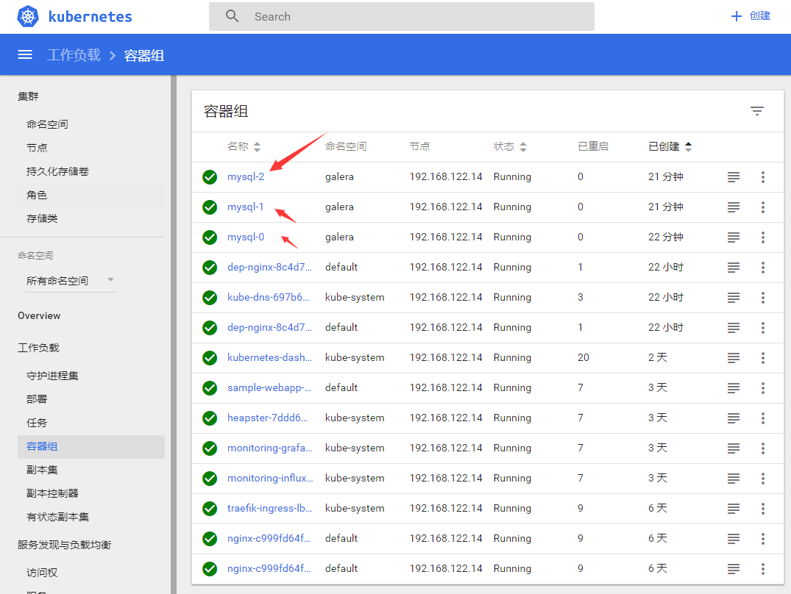
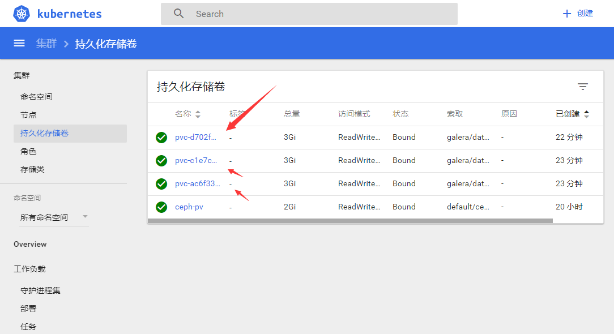
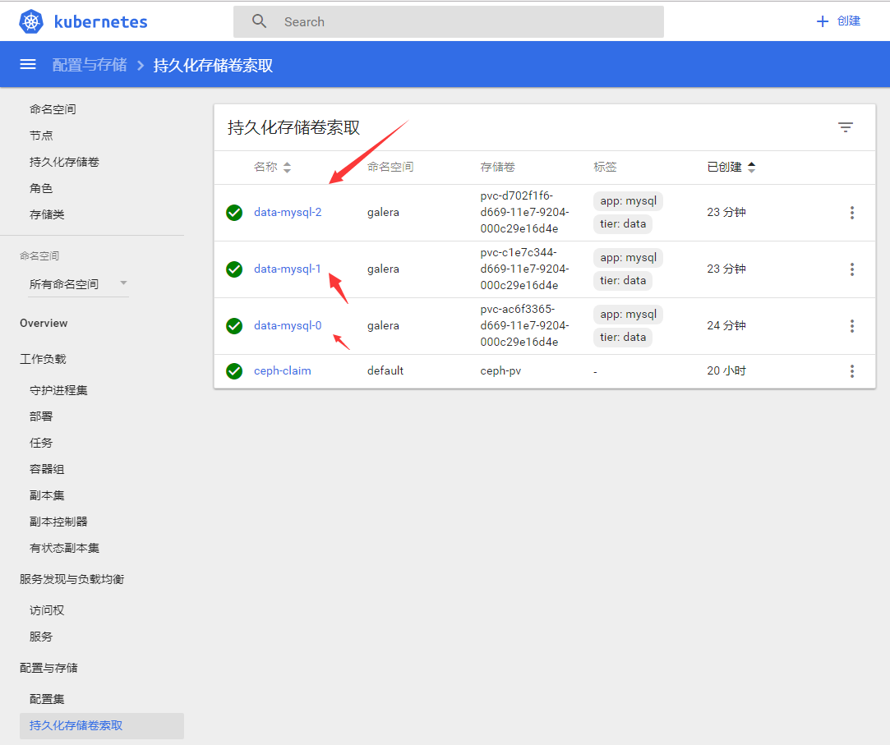
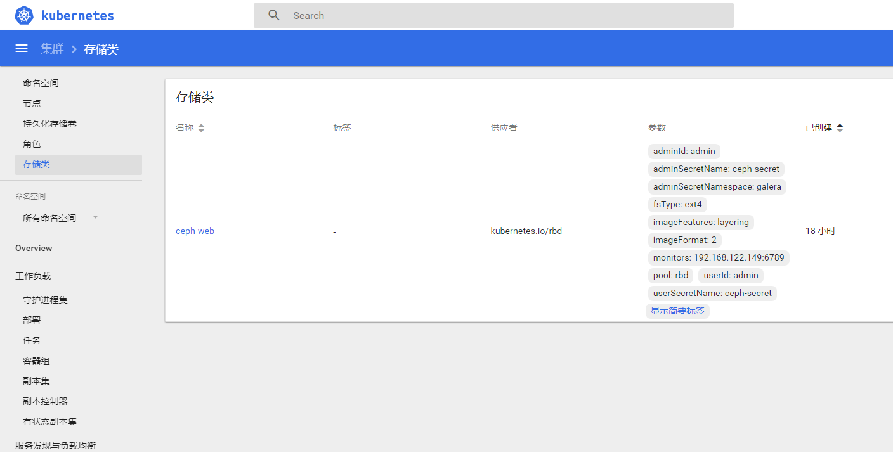

### k8s分布式存储测试,之前用的是nfs挂载的方式，现在来看看新的方式

	ceph存储节点：192.168.122.147
	k8s节点：192.168.122.148

### [ceph集群搭建](https://github.com/zouhuigang/kubernetes/blob/master/k8s_1.8.4/pv/ceph_install.md)

### 使用pv
>在kubernetes 的所有节点（尤其是 master 节点）上依然需要安装 ceph 客户端,还需要将 ceph 的配置文件 ceph.conf 放在所有节点的 /etc/ceph 目录下

	yum install -y ceph-common

将配置文件上传到/etc/ceph中

### 生成KEY

1. 生成 Ceph secret

使用 Ceph 管理员提供给你的 ceph.client.admin.keyring 文件，我们将它放在了 /etc/ceph 目录下，用来生成 secret。

	grep key /etc/ceph/ceph.client.admin.keyring |awk '{printf "%s", $NF}'|base64

得到加密后的key:

	QVFDcWZCOWEyZzJpQWhBQTFGRmFSa0YwT1o2Ly94WUczWTdGUHc9PQ==

2.创建Ceph secret

	apiVersion: v1
	kind: Secret
	metadata:
	  name: ceph-secret
	  namespace: galera
	type: "kubernetes.io/rbd"  
	data:
	  key: QVFDcWZCOWEyZzJpQWhBQTFGRmFSa0YwT1o2Ly94WUczWTdGUHc9PQ==

3.创建Ceph StorageClass

	apiVersion: storage.k8s.io/v1
	kind: StorageClass
	metadata:
	   name: ceph-web
	provisioner: kubernetes.io/rbd
	parameters:
	  monitors: 192.168.122.149
	  adminId: admin
	  adminSecretName: ceph-secret
	  adminSecretNamespace: galera
	  pool: rbd #此处默认是rbd池，生产上建议自己创建存储池隔离
	  userId: admin
	  userSecretName: ceph-secret

说明：

	monitors：Ceph Monitor的地址，多个地址可以用,分割。例如：192.168.122.149，192.168.122.150
	adminId： Ceph客户端用于创建块设备的用户；例如：cszhg
	adminSecretNamespace：admin的namespaces
	adminSecret：admin的SecretID
	pool： RBD的pool存储池
	userId: 用于块设备映射的用户ID，默认可以和admin一致
	userSecretName： Ceph-Secret的ID

创建：

	mkdir -p /home/kubernetes/ceph  && cd /home/kubernetes/ceph
	kubectl create -f galera-namespace.yaml 
	kubectl create -f ceph-secret.yaml 
	kubectl create -f ceph-storageclass.yaml

查看：

	$ kubectl get sc
	NAME       PROVISIONER
	ceph-web   kubernetes.io/rbd

### mysql

	mkdir -p /home/kubernetes/ceph/mysql && cd /home/kubernetes/ceph/mysql
	kubectl create -f .

### 创建完成

### 问题汇总

Q1:

	PersistentVolumeClaim is not bound: "data-mysql-0"

A1:

	

Q2: journalctl -xe -u kube-controller-manager出现错误：

	create volume failed, err: failed to create rbd image: exit status 1, command output: rbd: extraneous parameter --image-feature

	rbd.go:367] rbd: create volume failed, err: failed to create rbd image: exit status 1, command output: rbd: ex
	Nov 30 18:00:01 localhost.localdomain kube-controller-manager[31791]: W1130 18:00:01.415345   31791 rbd_util.go:395] failed to create rbd image, output rbd: extraneous parameter --image-feature
	Nov 30 18:00:01 localhost.localdomain kube-controller-manager[31791]: E1130 18:00:01.415414   31791 rbd.go:367] rbd: create volume failed, err: failed to create rbd image: exit status 1, command output: rbd: ex
	Nov 30 18:00:16 localhost.localdomain kube-controller-manager[31791]: W1130 18:00:16.421715   31791 rbd_util.go:395] failed to create rbd image, output rbd: extraneous parameter --image-feature

A2:

	这句话的错误是执行类似，在kube存储池创建一个映像文件，就叫ceph-claim，该映像文件的大小为5GB：
	rbd create kube/ceph-claim --size 5120 --image-format 2 --image-feature layering
	这样的命令之后，输出错误：
	rbd: extraneous parameter --image-feature

	which rbd

	http://tonybai.com/2016/11/07/integrate-kubernetes-with-ceph-rbd/
	https://github.com/kubernetes/kubernetes/issues/38923
	https://www.cnblogs.com/breezey/p/6558967.html
	http://www.jianshu.com/p/66a724a1f3af

升级内核：

	$ uname -r
	3.10.0-327.el7.x86_64

	rpm --import https://www.elrepo.org/RPM-GPG-KEY-elrepo.org
	rpm -Uvh http://www.elrepo.org/elrepo-release-7.0-2.el7.elrepo.noarch.rpm
	yum --enablerepo=elrepo-kernel install  kernel-ml-devel kernel-ml -y

	grub2-set-default 0
	grub2-mkconfig -o /boot/grub2/grub.cfg

	reboot

	$ uname -r
	4.14.3-1.el7.elrepo.x86_64

发现还是不行，发现去掉了--image-feature layering就好了。

	rbd create kube/ceph-claim --size 5120 --image-format 2 

删除images:

	rbd rm kube/ceph-claim

列出所有images:

	rbd list kube

查看ceph版本：

	ceph --version
	ceph version 0.94.5 (9764da52395923e0b32908d83a9f7304401fee43) 

发现跟之前搭建的ceph集群版本不对，之前用的是ceph version 10.2.10 (5dc1e4c05cb68dbf62ae6fce3f0700e4654fdbbe)

换版本：

	yum remove -y ceph-common
	按之前的方法，更新阿里yum源
	再安装yum install -y ceph-common,再查看版本
	$ ceph --version
	ceph version 10.2.10 (5dc1e4c05cb68dbf62ae6fce3f0700e4654fdbbe)

换了版本之后，需要再更新上传配置文件ceph.client.admin.keyring和ceph.conf到/etc/ceph目录下。

再运行：

	rbd create kube/ceph-claims --size 5120 --image-format 2 --image-feature layering

完全没问题了！！！

	

Q3:

 	 kubectl describe -n galera pvc data-mysql-0
	 Failed to provision volume with StorageClass "ceph-web"

	https://www.cnblogs.com/iiiiher/p/7159810.html

	https://crondev.com/kubernetes-persistent-storage-ceph/

	
	Official kube-controller-manager image doesn’t have rbd client installed, so I will use another image. Update image name in /etc/kubernetes/manifests/kube-controller-manager.yaml to this one quay.io/attcomdev/kube-controller-manager:v1.6.1 and wait until kube-controller-manager is restarted using a new image.

A3:

	看问题2的解决方法，ceph版本不一样。
	
	

