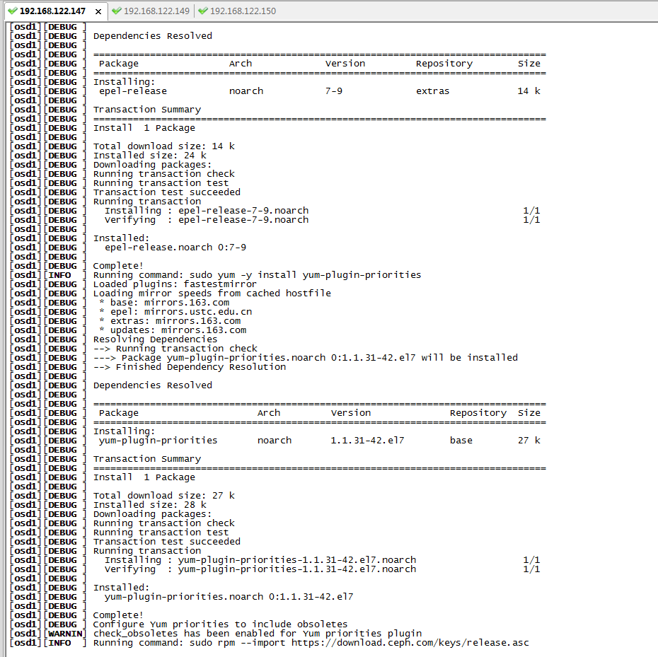
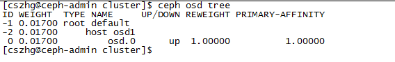

### ceph集群安装

修改主机名字：

	192.168.122.147 ceph-admin
	hostnamectl --static set-hostname ceph-admin
	
	192.168.122.149 mon1
	hostnamectl --static set-hostname mon1

	192.168.122.150 osd1
	hostnamectl --static set-hostname osd1

更新源：

删除默认源，这步可以跳过:

	#yum clean all
	#rm -rf /etc/yum.repos.d/*.repo

下载阿里云的base源
	
	yum install -y wget
	wget -O /etc/yum.repos.d/CentOS-Base.repo http://mirrors.aliyun.com/repo/Centos-7.repo

下载阿里云的epel源

	wget -O /etc/yum.repos.d/epel.repo http://mirrors.aliyun.com/repo/epel-7.repo

### 添加ceph源 (各节点都需要)：

vi /etc/yum.repos.d/ceph.repo：

	[ceph]
	name=ceph	
	baseurl=http://mirrors.aliyun.com/ceph/rpm-jewel/el7/x86_64/	
	gpgcheck=0
	priority =1

	[ceph-noarch]
	name=cephnoarch
	baseurl=http://mirrors.aliyun.com/ceph/rpm-jewel/el7/noarch/
	gpgcheck=0
	priority =1
	
	[ceph-source]	
	name=Ceph source packages
	baseurl=http://mirrors.aliyun.com/ceph/rpm-jewel/el7/SRPMS
	gpgcheck=0
	priority=1

### 安装 SSH 服务器(各节点都需要)

在各 Ceph 节点安装 SSH 服务器（如果还没有）：

    sudo yum install -y  openssh-server
	systemctl start sshd.service
	systemctl enable  sshd.service

    确保所有 Ceph 节点上的 SSH 服务器都在运行

### 设置各个主机的/etc/hosts文件

	192.168.122.147 ceph-admin
	192.168.122.149 mon1
	192.168.122.150 osd1
	# xxxxxx osd2 #后续可以添加
	# xxxxxx osd3 

## 允许无密码 SSH 登录
> ceph-deploy 不支持输入密码，你必须在管理节点上生成 SSH 密钥并把其公钥分发到各 Ceph 节点, ceph-deploy 会尝试给初始 monitors 生成 SSH 密钥对!

	
##### 创建用户(各节点都需要)

	sed -i 's/SELINUX=enforcing/SELINUX=disabled/g' /etc/selinux/config #禁用selinux

在各 Ceph 节点创建新用户,你要用自己取的名字替换 {username}。

	ssh user@ceph-server
	sudo useradd -d /home/{username} -m {username}
	sudo passwd {username}

赋予权限（确保各 Ceph 节点上新创建的用户都有 sudo 权限）：

	echo "{username} ALL = (root) NOPASSWD:ALL" | sudo tee /etc/sudoers.d/{username}
	sudo chmod 0440 /etc/sudoers.d/{username}

我用的是：

	 useradd -d /home/cszhg -m cszhg
	 passwd cszhg  #设置密码，设置了12345678

	 #确保各 Ceph 节点上新创建的用户都有 sudo 权限
	 echo "cszhg ALL = (root) NOPASSWD:ALL" | sudo tee /etc/sudoers.d/cszhg
	 sudo chmod 0440 /etc/sudoers.d/cszhg
	 #tty权限,sudo默认需要tty终端
	 sed -i s'/Defaults requiretty/#Defaults requiretty'/g /etc/sudoers

##### config(不存在则新创建一个):
>修改 ceph-deploy 管理节点上的 ~/.ssh/config 文件，这样 ceph-deploy 就能用你所建的用户名登录 Ceph 节点了，而无需每次执行 ceph-deploy 都要指定 --username {username} 。这样做同时也简化了 ssh 和 scp 的用法。把 {username} 替换成你创建的用户名

vi ~/.ssh/config:

	Host node1
	   Hostname node1
	   User {username}
	Host node2
	   Hostname node2
	   User {username}
	Host node3
	   Hostname node3
	   User {username}

我用的是：

	[root@k8s-master .ssh]# cat config 
	Host ceph-admin
	   Hostname ceph-admin
	   User cszhg
	Host mon1
	   Hostname mon1
	   User cszhg
	Host osd1
	   Hostname osd1
	   User cszhg

修改config权限：
	
	chmod 644 ~/.ssh/config

在各个主机上，生成 SSH 密钥对，但不要用 sudo 或 root 用户。提示 “Enter passphrase” 时，直接回车，口令即为空:
	
	su cszhg #切换成刚刚创建的用户,防止无密码登录到root上了
	ssh-keygen

在各个主机之间复制key，实现无密码访问：

	ssh-copy-id cszhg@ceph-admin
	ssh-copy-id cszhg@mon1
	ssh-copy-id osd1

注意: ssh-copy-id 将key写到远程机器的 ~/ .ssh/authorized_key.文件中，并在本机上生成一个known_hosts文件

测试无密码登录,在mon1主机上：

	ssh ceph-admin

会显示登录成功,并切换了到了远程：
	
	[cszhg@localhost .ssh]$ ssh ceph-admin
	Last login: Wed Nov 29 02:35:05 2017 from mon1
	[cszhg@k8s-master ~]$ 

### 安装时间同步

	yum install -y ntp ntpdate ntp-doc
	ntpdate ntp.api.bz 
	hwclock --systohc
	systemctl enable ntpd.service
	systemctl start ntpd.service

### 关闭selinux&firewalld

	sed -i 's/SELINUX=.*/SELINUX=disabled/' /etc/selinux/config
	setenforce 0
	systemctl stop firewalld 
	systemctl disable firewalld

### 正式安装

安装ceph-deploy

	sudo yum update -y && sudo yum install ceph-deploy -y

创建cluster目录

	su - cszhg
	mkdir cluster
	cd cluster/

创建集群：

	ceph-deploy new mon1

日志：

	[cszhg@ceph-admin cluster]$ ceph-deploy new mon1
	[ceph_deploy.conf][DEBUG ] found configuration file at: /home/cszhg/.cephdeploy.conf
	[ceph_deploy.cli][INFO  ] Invoked (1.5.39): /usr/bin/ceph-deploy new mon1
	[ceph_deploy.cli][INFO  ] ceph-deploy options:
	[ceph_deploy.cli][INFO  ]  username                      : None
	[ceph_deploy.cli][INFO  ]  func                          : <function new at 0x2a4f500>
	[ceph_deploy.cli][INFO  ]  verbose                       : False
	[ceph_deploy.cli][INFO  ]  overwrite_conf                : False
	[ceph_deploy.cli][INFO  ]  quiet                         : False
	[ceph_deploy.cli][INFO  ]  cd_conf                       : <ceph_deploy.conf.cephdeploy.Conf instance at 0x2ac1680>
	[ceph_deploy.cli][INFO  ]  cluster                       : ceph
	[ceph_deploy.cli][INFO  ]  ssh_copykey                   : True
	[ceph_deploy.cli][INFO  ]  mon                           : ['mon1']
	[ceph_deploy.cli][INFO  ]  public_network                : None
	[ceph_deploy.cli][INFO  ]  ceph_conf                     : None
	[ceph_deploy.cli][INFO  ]  cluster_network               : None
	[ceph_deploy.cli][INFO  ]  default_release               : False
	[ceph_deploy.cli][INFO  ]  fsid                          : None
	[ceph_deploy.new][DEBUG ] Creating new cluster named ceph
	[ceph_deploy.new][INFO  ] making sure passwordless SSH succeeds
	[mon1][DEBUG ] connected to host: ceph-admin 
	[mon1][INFO  ] Running command: ssh -CT -o BatchMode=yes mon1
	[mon1][DEBUG ] connection detected need for sudo
	[mon1][DEBUG ] connected to host: mon1 
	[mon1][DEBUG ] detect platform information from remote host
	[mon1][DEBUG ] detect machine type
	[mon1][DEBUG ] find the location of an executable
	[mon1][INFO  ] Running command: sudo /usr/sbin/ip link show
	[mon1][INFO  ] Running command: sudo /usr/sbin/ip addr show
	[mon1][DEBUG ] IP addresses found: [u'192.168.122.149']
	[ceph_deploy.new][DEBUG ] Resolving host mon1
	[ceph_deploy.new][DEBUG ] Monitor mon1 at 192.168.122.149
	[ceph_deploy.new][DEBUG ] Monitor initial members are ['mon1']
	[ceph_deploy.new][DEBUG ] Monitor addrs are ['192.168.122.149']
	[ceph_deploy.new][DEBUG ] Creating a random mon key...
	[ceph_deploy.new][DEBUG ] Writing monitor keyring to ceph.mon.keyring...
	[ceph_deploy.new][DEBUG ] Writing initial config to ceph.conf...
	[cszhg@ceph-admin cluster]$ 

多出的文件：

	[cszhg@ceph-admin cluster]$ ls
	ceph.conf  ceph-deploy-ceph.log  ceph.mon.keyring

修改ceph.conf文件：

vi ceph.conf,增加:

	# Your network address
	public network = 192.168.122.0/24  ##这个 192.168.0.0/24会提示网络 不可用
	osd pool default size = 1 #osd的数量

安装ceph

	ceph-deploy install ceph-admin mon1 osd1 

安装截图：

初始化monitor，并收集所有密钥：

	ceph-deploy mon create-initial
	ceph-deploy gatherkeys mon1

### 添加OSD到集群

检查OSD节点上所有可用的磁盘
	
	ceph-deploy disk list osd1

删除节点分区

	ceph-deploy disk zap osd1:/dev/vdb

准备OSD

	ceph-deploy osd prepare osd1:/dev/vdb

### 添加新osd

	ssh osd1
	sudo mkdir /var/local/osd0
	sudo chmod -R 777 /var/local/osd0/ ###给与权限

### 准备osd
	
	ceph-deploy osd prepare osd1:/var/local/osd0

### 激活osd:

	ceph-deploy osd activate osd1:/var/local/osd0

成功显示：

	

###问题汇总

Q1:sudo: sorry, you must have a tty to run sudo

A1:
	编辑 /etc/sudoers (最好用visudo命令)
	
	注释掉 Default requiretty 一行
	
	#Default requiretty

	意思就是sudo默认需要tty终端。注释掉就可以在后台执行了，编辑配置文件 /etc/sudoers 时，必须用 sudo visudo 而不是文本编辑器。
	

Q2: yum lock; waiting for it to exit

A2: 强制关闭
	rm -f /var/run/yum.pid

Q3:applydeltarpm not installed

A3:
	
	yum update
	yum provides '*/applydeltarpm'
	yum install deltarpm -y
	

Q4: yum -y install ceph ceph-radosgw

	Timeout on http://download.ceph.com/rpm-jewel/el7/x86_64/ceph-common-10.2.10-0.el7.x86_64.rpm: (28, 'Operation too slow. Less than 1000 bytes/sec transferred the last 30 seconds')

	[osd1][DEBUG ] Install  2 Packages (+47 Dependent packages)
	[osd1][DEBUG ] 
	[osd1][DEBUG ] Total size: 60 M
	[osd1][DEBUG ] Total download size: 44 M
	[osd1][DEBUG ] Installed size: 221 M
	[osd1][DEBUG ] Downloading packages:
	[osd1][DEBUG ] No Presto metadata available for Ceph
	[osd1][WARNIN] No data was received after 300 seconds, disconnecting...
	[osd1][INFO  ] Running command: sudo ceph --version
	[osd1][ERROR ] Traceback (most recent call last):
	[osd1][ERROR ]   File "/usr/lib/python2.7/site-packages/ceph_deploy/lib/vendor/remoto/process.py", line 119, in run
	[osd1][ERROR ]     reporting(conn, result, timeout)
	[osd1][ERROR ]   File "/usr/lib/python2.7/site-packages/ceph_deploy/lib/vendor/remoto/log.py", line 13, in reporting
	[osd1][ERROR ]     received = result.receive(timeout)
	[osd1][ERROR ]   File "/usr/lib/python2.7/site-packages/ceph_deploy/lib/vendor/remoto/lib/vendor/execnet/gateway_base.py", line 704, in receive
	[osd1][ERROR ]     raise self._getremoteerror() or EOFError()
	[osd1][ERROR ] RemoteError: Traceback (most recent call last):
	[osd1][ERROR ]   File "<string>", line 1036, in executetask
	[osd1][ERROR ]   File "<remote exec>", line 12, in _remote_run
	[osd1][ERROR ]   File "/usr/lib64/python2.7/subprocess.py", line 711, in __init__
	[osd1][ERROR ]     errread, errwrite)
	[osd1][ERROR ]   File "/usr/lib64/python2.7/subprocess.py", line 1327, in _execute_child
	[osd1][ERROR ]     raise child_exception
	[osd1][ERROR ] OSError: [Errno 2] No such file or directory
	[osd1][ERROR ] 
	[osd1][ERROR ] 
	[ceph_deploy][ERROR ] RuntimeError: Failed to execute command: ceph --version
		
	Error in sys.exitfunc:

A4:

下载不下来，直接更改源

	yum clean all
	rm -rf /etc/yum.repos.d/*.repo
	wget -O /etc/yum.repos.d/CentOS-Base.repo http://mirrors.aliyun.com/repo/Centos-7.repo
	wget -O /etc/yum.repos.d/epel.repo http://mirrors.aliyun.com/repo/epel-7.repo
	sed -i '/aliyuncs/d' /etc/yum.repos.d/CentOS-Base.repo
	sed -i '/aliyuncs/d' /etc/yum.repos.d/epel.repo
	sed -i 's/$releasever/7/g' /etc/yum.repos.d/CentOS-Base.repo

增加	ceph源

vi /etc/yum.repos.d/ceph.repo

	[ceph]
	name=ceph
	baseurl=http://mirrors.163.com/ceph/rpm-jewel/el7/x86_64/
	gpgcheck=0
	[ceph-noarch]
	name=cephnoarch
	baseurl=http://mirrors.163.com/ceph/rpm-jewel/el7/noarch/
	gpgcheck=0

安装ceph客户端：

	yum makecache
	yum install ceph ceph-radosgw rdate -y

直接使用ceph-deploy install ceph-admin mon1 osd1 会覆盖yum源，尽量先安装好。

Q5：

	[mon1][WARNIN] 2017-11-29 22:00:19.633399 7f0683572600 -1 unable to find any IP address in networks: 192.168.0.0/24
	[mon1][ERROR ] RuntimeError: command returned non-zero exit status: 1

A5：
	将ip地址改成：public_network=192.168.122.0/24
	https://github.com/ceph/ceph/pull/2306

Q6：修改了配置文件之后，会报错

	RuntimeError: config file /etc/ceph/ceph.conf exists with different content; use --overwrite-conf to overwrite

A6:	

	ceph-deploy --overwrite-conf mon create-initial 
	推送配置到其他节点
	ceph-deploy --overwrite-conf config push ceph-admin mon1 osd1 

Q7：

	 ceph -s
	 auth: unable to find a keyring on /etc/ceph/ceph.client.admin.keyring

A7:

	权限问题，修改为sudo chmod 755 /etc/ceph/ceph.client.admin.keyring

	http://blog.chinaunix.net/uid-21142030-id-5194237.html

Q8:

	[cszhg@ceph-admin ceph]$ ceph -s
	2017-11-29 23:17:47.058839 7f6974543700  0 -- :/2275192372 >> 192.168.122.149:6789/0 pipe(0x7f69780640a0 sd=3 :0 s=1 pgs=0 cs=0 l=1 c=0x7f697805c700).fault
	2017-11-29 23:17:50.060290 7f6974442700  0 -- :/2275192372 >> 192.168.122.149:6789/0 pipe(0x7f696c000c80 sd=3 :0 s=1 pgs=0 cs=0 l=1 c=0x7f696c001f90).fault
	2017-11-29 23:17:53.060906 7f6974543700  0 -- :/2275192372 >> 192.168.122.149:6789/0 pipe(0x7f696c0052b0 sd=3 :0 s=1 pgs=0 cs=0 l=1 c=0x7f696c006570).fault
	2017-11-29 23:17:56.062140 7f6974442700  0 -- :/2275192372 >> 192.168.122.149:6789/0 pipe(0x7f696c000c80 sd=3 :0 s=1 pgs=0 cs=0 l=1 c=0x7f696c002410).fault
	2017-11-29 23:17:59.063260 7f6974543700  0 -- :/2275192372 >> 192.168.122.149:6789/0 pipe(0x7f696c0052b0 sd=3 :0 s=1 pgs=0 cs=0 l=1 c=0x7f696c002f60).fault
	2017-11-29 23:18:02.064869 7f6974442700  0 -- :/2275192372 >> 192.168.122.149:6789/0 pipe(0x7f696c000c80 sd=3 :0 s=1 pgs=0 cs=0 l=1 c=0x7f696c0036d0).fault
	2017-11-29 23:18:05.065475 7f6974543700  0 -- :/2275192372 >> 192.168.122.149:6789/0 pipe(0x7f696c0052b0 sd=3 :0 s=1 pgs=0 cs=0 l=1 c=0x7f696c002a10).fault
	2017-11-29 23:18:08.066544 7f6974442700  0 -- :/2275192372 >> 192.168.122.149:6789/0 pipe(0x7f696c000c80 sd=3 :0 s=1 pgs=0 cs=0 l=1 c=0x7f696c008d40).fault

A8:

	关闭mon1的selinux&firewalld
	http://bbs.csdn.net/topics/390684714
	

Q9:
	ceph-deploy disk list osd1

	[ceph_deploy][ERROR ] ConfigError: Cannot load config: [Errno 2] No such file or directory: 'ceph.conf'; has `ceph-deploy new` been run in this directory?

Q10:

	ceph health detail 

	pg 0.3f is stuck unclean for 8980.708897, current state creating, last acting []
	pg 0.4 is stuck unclean for 8980.708967, current state creating, last acting []
	pg 0.5 is stuck unclean for 8980.708968, current state creating, last acting []
	pg 0.6 is stuck unclean for 8980.708968, current state creating, last acting []
	pg 0.7 is stuck unclean for 8980.708969, current state creating, last acting []
	pg 0.8 is stuck unclean for 8980.708970, current state creating, last acting []
	pg 0.9 is stuck unclean for 8980.708970, current state creating, last acting []
	pg 0.a is stuck unclean for 8980.708971, current state creating, last acting []
	pg 0.b is stuck unclean for 8980.708971, current state creating, last acting []
	pg 0.c is stuck unclean for 8980.708972, current state creating, last acting []
	pg 0.d is stuck unclean for 8980.708961, current state creating, last acting []
	pg 0.e is stuck unclean for 8980.708961, current state creating, last acting []
	pg 0.f is stuck unclean for 8980.708962, current state creating, last acting []

参考文档：

https://www.cnblogs.com/netmouser/p/6876846.html

https://github.com/nodejs-viathink/ceph/blob/master/docs/singleNodeObjectStorage.md

http://docs.ceph.org.cn/

http://docs.ceph.org.cn/start/quick-start-preflight/#rpm

http://blog.csdn.net/beanjoy/article/details/66974808

http://blog.csdn.net/u014139942/article/details/53639124

http://blog.csdn.net/younger_china/article/details/51823571

http://bbs.ceph.org.cn/question/390

http://www.xuxiaopang.com/2016/10/09/ceph-quick-install-el7-jewel/

