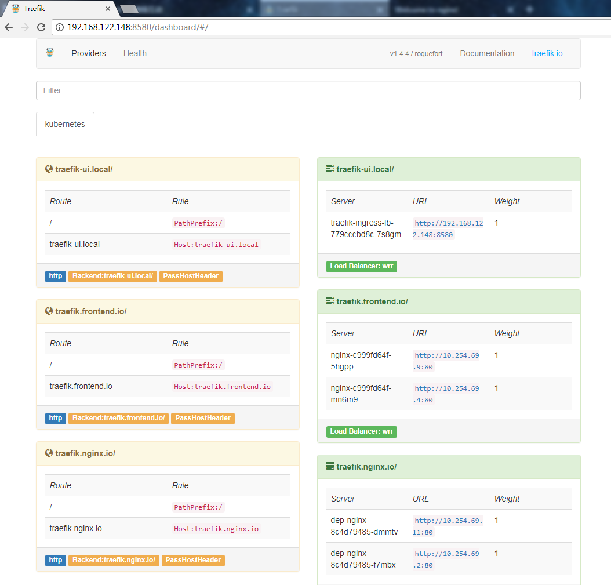
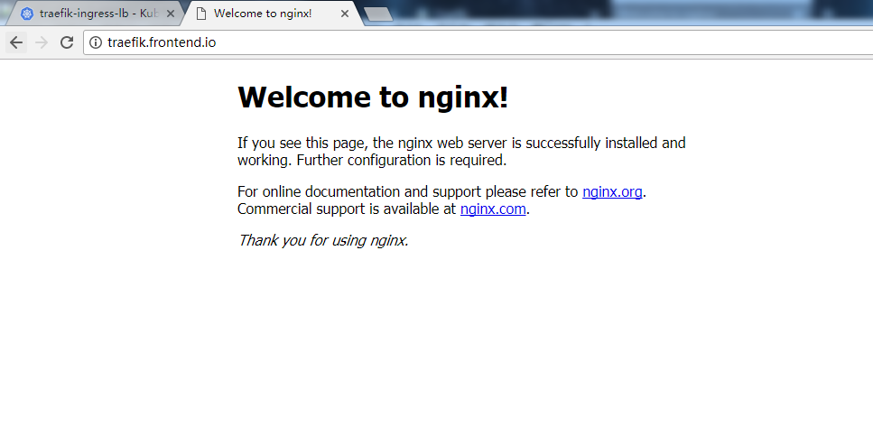
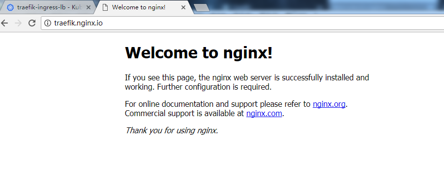

### 1.8.4版本下，重新创建traefik+ingress

### 镜像

	docker pull traefik

创建ingress-rbac.yaml

>将用于service account验证

	apiVersion: v1
	kind: ServiceAccount
	metadata:
	  name: ingress
	  namespace: kube-system
	
	---
	
	kind: ClusterRoleBinding
	apiVersion: rbac.authorization.k8s.io/v1beta1
	metadata:
	  name: ingress
	subjects:
	  - kind: ServiceAccount
	    name: ingress
	    namespace: kube-system
	roleRef:
	  kind: ClusterRole
	  name: cluster-admin
	  apiGroup: rbac.authorization.k8s.io

创建规则ingress-rule.yaml

	$ kubectl get svc
	NAME              TYPE        CLUSTER-IP       EXTERNAL-IP   PORT(S)        AGE
	dep-nginx         ClusterIP   10.254.188.157   <none>        80/TCP         11h
	example-service   NodePort    10.254.234.253   <none>        80:31831/TCP   1d
	kubernetes        ClusterIP   10.254.0.1       <none>        443/TCP        2d
	nginx             ClusterIP   10.254.219.169   <none>        80/TCP         11h

ingress访问规则对应：

	apiVersion: extensions/v1beta1
	kind: Ingress
	metadata:
	  name: traefik-ingress
	  namespace: default
	spec:
	  rules:
	  - host: traefik.nginx.io
	    http:
	      paths:
	      - path: /
	        backend:
	          serviceName: dep-nginx
	          servicePort: 80
	  - host: traefik.frontend.io
	    http:
	      paths:
	      - path: /
	        backend:
	          serviceName: example-service
	          servicePort: 80

其中的traefik.nginx.io和traefik.frontend.io需要在hosts中指定ip映射。

traefik服务：

	traefik-dep.yaml和traefik-ui-rule.yaml

### 创建

	mkdir -p /home/kubernetes/traefik
	#将文件上传到该目录
	kubectl create -f .

### 访问

访问traefik面板:

	http://192.168.122.148:8580/

在windows下，配置hosts的ip映射,win+r输入

	%SystemRoot%\System32\drivers\etc\hosts

配置：

	192.168.122.148 traefik.nginx.io
	192.168.122.148 traefik.frontend.io

在浏览器输入域名查看：

在Linux下测试可以使用命令：

	curl -H Host:traefik.nginx.io http://192.168.122.148/

如：

	$  curl -H Host:traefik.nginx.io http://192.168.122.148/
	<!DOCTYPE html>
	<html>
	<head>
	<title>Welcome to nginx!</title>
	
	</head>
	<body>
	<h1>Welcome to nginx!</h1>
	
If you see this page, the nginx web server is successfully installed and
	working. Further configuration is required.

	
	
For online documentation and support please refer to
	<a href="http://nginx.org/">nginx.org</a>. 
	Commercial support is available at
	<a href="http://nginx.com/">nginx.com</a>.

	
	
<em>Thank you for using nginx.</em>

	</body>
	</html>

