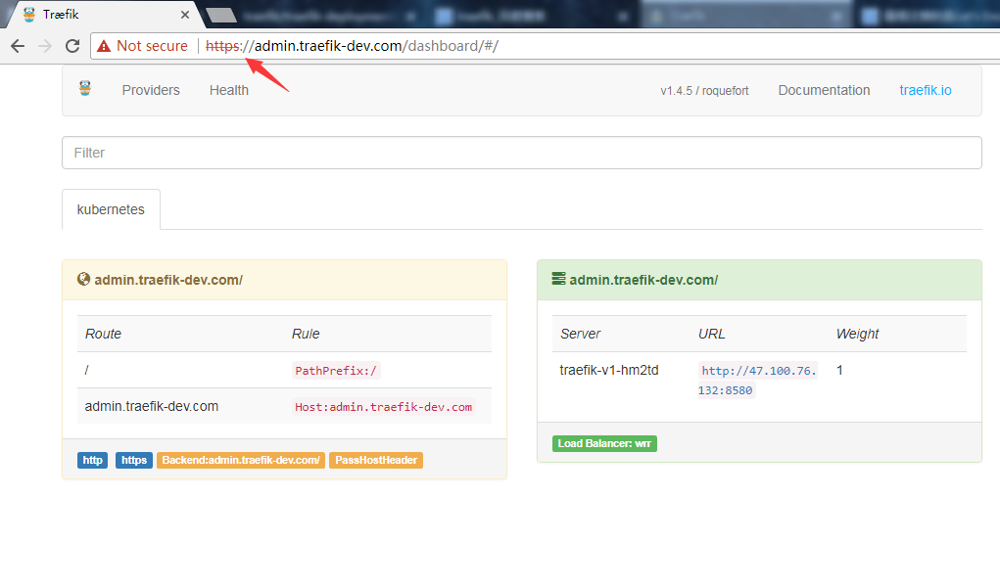

### 在k8s中，创建一个命名空间loadbalancer

	kubectl create -f namesapce.yaml

###创建rbac认证

	kubectl create -f rbac.yaml

### 创建空的acme.json文件，并赋予600权限

	touch acme.json && chmod 600 acme.json

### 修改traefik.toml文件，及认证

	htdigest -c user.dat traefik guest #输入密码之后，得到一个文件user.dat

	建一个名为 guest 的用户，并存储在 user.dat 中，用于后面的密码验证

将user.dat得到的数据写入traefik.toml中

	[entryPoints.https.auth.digest]
    # 这一内容来自前面生成的 user.dat，所有服务都启用这一验证
    users = ["zhg:traefik:54923e7537f7a0523fa7a4ac362d418d"]
    [entryPoints.https.tls]

自定义域名

	[[acme.domains]]
	main = "traefik-dev.com"
	sans = ["admin.traefik-dev.com", "m.traefik-dev.com"]
	
	[[acme.domains]]
	main = "car.com"
	sans = ["www.car.com", "m.car.com"]

### 创建rc

	kubectl create -f rc.yaml

### 创建ui及ingress rule

	kubectl create -f ui-svc.yaml
	kubectl create -f ui-svc-ingress.yaml

### 设置windows上的hosts域名与ip的映射关系

### 然后浏览器访问

	https://admin.traefik-dev.com/dashboard/#/

输入之前设置的用户名和密码认证

	https://www.car.com/

	

